<p align="center">
  
</p>

<p align="center">
  <b>Self-hosted memory, sessions, and dashboard for AI coding agents</b>
</p>

<p align="center">
  <i>One Docker image, one process, one SQLite file. Multi-client by construction, reversible by design.</i>
</p>

<p align="center">
  <a href="#supported-agents">Supported agents</a> ·
  <a href="#quickstart">Quickstart</a> ·
  <a href="#configuration">Configuration</a> ·
  <a href="#dashboard">Dashboard</a> ·
  <a href="#architecture">Architecture</a> ·
  <a href="#project-status">Project status</a> ·
  <a href="#contributing">Contributing</a> ·
  <a href="#sponsor">Sponsor</a>
  <br/>
  <sub>More docs: <a href="./docs/agents.md">Agent integration</a> · <a href="./docs/updates.md">Updates</a> · <a href="./docs/troubleshooting.md">Troubleshooting</a> · <a href="./docs/docker.md">Docker</a> · <a href="./docs/backup.md">Backup</a> · <a href="./docs/embeddings.md">Embeddings</a> · <a href="./docs/relations.md">Relations</a></sub>
</p>

---

> **rembric** /ˈrem.brɪk/ — _coined, from_ remember + fabric: the woven memory and lifecycle layer beneath your agents. One brain, one dashboard, one audit trail — shared across every MCP-capable tool: Claude Code, Codex CLI, Hermes Agent, opencode, Cursor, and beyond. The MCP memory surface is the core; sessions, judgments, consolidation, and the operator dashboard come along in the same single Node process.

## Supported agents

Rembric works with any agent that speaks MCP or HTTP. First-class plugins handle session lifecycle + per-project path-scoping automatically, and redact `<private>…</private>` spans client-side before any transcript-derived text is uploaded (see [docs/agents.md](./docs/agents.md#private-content-redaction-private-tags)); everything else gets the same memory tools via a plain MCP URL. **ChatGPT** connects as a custom MCP connector over OAuth 2.1 (no static token) — see [docs/agents.md](./docs/agents.md#chatgpt-custom-mcp-connector-over-oauth).

<table>
  <tr>
    <td align="center" valign="top" width="20%">
      <a href="./apps/plugin/README.md"><br/><b>Claude Code</b></a><br/>
      <sub>native plugin · 4 hooks · MCP</sub>
    </td>
    <td align="center" valign="top" width="20%">
      <a href="./apps/plugin/.opencode-plugin/README.md"><br/><b>opencode</b></a><br/>
      <sub>native plugin · MCP</sub>
    </td>
    <td align="center" valign="top" width="20%">
      <a href="./docs/agents.md#codex-cli-recommended-bundled-plugin"><br/><b>Codex CLI</b></a><br/>
      <sub>native plugin · 4 hooks · MCP</sub>
    </td>
    <td align="center" valign="top" width="20%">
      <a href="./apps/plugin/.hermes-plugin/README.md"><br/><b>Hermes Agent</b></a><br/>
      <sub>native provider · MCP</sub>
    </td>
    <td align="center" valign="top" width="20%">
      <a href="./docs/agents.md#chatgpt-custom-mcp-connector-over-oauth"><br/><b>ChatGPT</b></a><br/>
      <sub>custom connector · OAuth · MCP</sub>
    </td>
  </tr>
</table>

<details>
<summary><b>Any other MCP client</b> — Cursor · Windsurf · Claude Desktop · Cline · Goose · Kilo Code · Roo Code · Gemini CLI · …</summary>

<br>

<table>
  <tr>
    <td align="center" valign="top" width="25%">
      <a href="./docs/agents.md#any-other-mcp-client"><br/><b>Cursor</b></a><br/>
      <sub>MCP server</sub>
    </td>
    <td align="center" valign="top" width="25%">
      <a href="./docs/agents.md#any-other-mcp-client"><br/><b>Windsurf</b></a><br/>
      <sub>MCP server</sub>
    </td>
    <td align="center" valign="top" width="25%">
      <a href="./docs/agents.md#any-other-mcp-client"><br/><b>Claude Desktop</b></a><br/>
      <sub>MCP server</sub>
    </td>
    <td align="center" valign="top" width="25%">
      <a href="./docs/agents.md#any-other-mcp-client"><br/><b>Cline</b></a><br/>
      <sub>MCP server</sub>
    </td>
  </tr>
  <tr>
    <td align="center" valign="top">
      <a href="./docs/agents.md#any-other-mcp-client"><br/><b>Goose</b></a><br/>
      <sub>MCP server</sub>
    </td>
    <td align="center" valign="top">
      <a href="./docs/agents.md#any-other-mcp-client"><br/><b>Kilo Code</b></a><br/>
      <sub>MCP server</sub>
    </td>
    <td align="center" valign="top">
      <a href="./docs/agents.md#any-other-mcp-client"><br/><b>Roo Code</b></a><br/>
      <sub>MCP server</sub>
    </td>
    <td align="center" valign="top">
      <a href="./docs/agents.md#any-other-mcp-client"><br/><b>Gemini CLI</b></a><br/>
      <sub>MCP server</sub>
    </td>
  </tr>
</table>

</details>

## Quickstart

**One installer does everything.** A single brand-styled menu prepares the server (writes `docker-compose.yml` + `.env`, generates your admin token) and installs / updates / uninstalls every agent plugin — detecting what you have and at which version. It is the recommended way to install, set up, upgrade, and remove Rembric.

```bash
curl -fsSL https://raw.githubusercontent.com/susomejias/rembric/main/install.sh | sh
```

Pick **Server → install**: it generates `REMBRIC_ADMIN_TOKEN` and, if Docker is present and you confirm, runs `docker compose up -d` for you. Then pick **Plugins** to install the plugin for your agent. Pin a release for reproducibility with `--ref=<tag>`.

Docker is the canonical distribution: the image bundles Node 22, the native modules (`better-sqlite3`, `sqlite-vec`, `onnxruntime-node`) and the embedding model, pre-built for `linux/amd64` and `linux/arm64` — the only requirement on your host is Docker and ~1 GB of RAM (2 GB recommended; the in-process embedder is why — see [docs/embeddings.md](./docs/embeddings.md)).

MCP at `http://<host>:8787/mcp`, dashboard at `http://<host>:8787/dashboard` (replace `<host>` with `127.0.0.1` if running on the same host as your agent, or the LAN/Tailscale hostname of the box hosting Rembric otherwise).

<details>
<summary><b>Prefer to read it before running?</b> — download the installer, inspect it, then execute</summary>

<br>

```bash
curl -fsSL https://raw.githubusercontent.com/susomejias/rembric/main/install.sh -o rembric-install.sh
less rembric-install.sh        # skim it
sh rembric-install.sh
```

</details>

<details>
<summary><b>Manual / advanced</b> — set up the server by hand, remote vs loopback, upgrade, rollback, backups</summary>

<br>

### Set up the server by hand

Prefer to skip the installer? Fetch the compose file and env template and bring it up yourself:

```bash
mkdir rembric && cd rembric
curl -fsSLO https://raw.githubusercontent.com/susomejias/rembric/main/docker-compose.yml
curl -fsSL  https://raw.githubusercontent.com/susomejias/rembric/main/.env.example -o .env

# edit .env:  set REMBRIC_ADMIN_TOKEN (e.g. `openssl rand -hex 32`) — that's it

docker compose up -d
docker compose logs -f rembric
```

### Running on a remote host (LXC, NAS, server) — the canonical case

The compose file publishes port `8787` on **all interfaces** of the host so your agent on another machine can reach it. Point the plugin at `http://<host-ip>:8787` (LAN) or `http://rembric.tailnet:8787` (Tailscale). Don't expose port 8787 directly to the public internet — front it with Tailscale, WireGuard, or your reverse proxy of choice. The bearer token is the real security boundary; every endpoint requires `Authorization: Bearer <token>`.

### Running on the same host as your agent — loopback override

If you want to restrict the published port to loopback (stricter posture, same-host dev only), drop a `docker-compose.override.yml` next to the canonical compose:

```yaml
services:
  rembric:
    ports: !override
      - '127.0.0.1:${REMBRIC_PORT:-8787}:8787'
```

Compose auto-merges the override on every `up`. Point your agent at `http://127.0.0.1:8787`. See [`docs/docker.md`](./docs/docker.md) for the full topology guide.

### Upgrading

**Auto-updater from the UI.** The dashboard checks for new releases (once a day, [opt-out](./docs/updates.md)) and shows a badge + changelog modal when one is out. Mount the Docker socket and the same modal gains a one-click **Update** button that backs up the database, pulls the new image, swaps the container with health-check and rollback, and reloads the page on the new version — see [docs/updates.md](./docs/updates.md) for setup and the security trade-off. Without the socket nothing breaks: you get the notification plus the manual flow below.

Docker manages versions for you. With `REMBRIC_VERSION` unset in `.env`, the compose file pulls `:latest`:

```bash
docker compose pull
docker compose up -d
```

Portainer / Arcane detect the new digest automatically and offer a "Recreate container" button — one click. For reproducible deploys, pin a specific version in `.env` (this also disables the one-click updater — the dashboard explains why):

```ini
REMBRIC_VERSION=0.21.9
```

### Rolling back

Bump `REMBRIC_VERSION` to a previous tag in `.env` and re-run `docker compose up -d`. The bind-mounted `./data/` directory is untouched, so your memory stays intact across version flips.

See [docs/docker.md](./docs/docker.md) for the full operator guide (private GHCR auth, named-volume vs bind-mount, troubleshooting).

### Backups

The runtime image is [distroless](./docs/docker.md) — there is no shell and no `sqlite3` binary inside the container, so `docker compose exec rembric sqlite3 ...` does not work. Use one of:

```bash
# while the container is running (WAL-safe online backup, no shell needed):
# open the dashboard → Maintenance → "Backup now", then download the
# resulting snapshot from the same page.

# or stop + copy for a cold backup (works against any image):
docker compose down
cp ./data/data.db ./backups/data-$(date +%Y%m%d).db
docker compose up -d
```

**Do not bind-mount `./data/` onto NFS / SMB / network filesystems** — SQLite's POSIX locking guarantees don't hold there, and you'll eventually corrupt the DB.

See [docs/backup.md](./docs/backup.md) for the full restore procedure, including the data-loss guard an older snapshot will trip.

</details>

## Configuration

All config via environment variables. With Docker, these live in `.env` and are loaded automatically by `docker compose up`. Required: `REMBRIC_ADMIN_TOKEN` (used to log into the dashboard and mint other tokens).

| Variable               | Default                           | Description                                                                                                                                                                                                                                                 |
| ---------------------- | --------------------------------- | ----------------------------------------------------------------------------------------------------------------------------------------------------------------------------------------------------------------------------------------------------------- |
| `REMBRIC_HOST`         | `127.0.0.1` (`0.0.0.0` in Docker) | Bind address. Pinned to `0.0.0.0` inside the container so the published port works; never override in Docker.                                                                                                                                               |
| `REMBRIC_PORT`         | `8787`                            | Bind port.                                                                                                                                                                                                                                                  |
| `REMBRIC_DATA_DIR`     | `~/.rembric` (`/data` in Docker)  | Where the SQLite file lives. Pinned to `/data` inside the container; bind-mount `./data:/data` in compose.                                                                                                                                                  |
| `LOG_LEVEL`            | `info`                            | `debug` / `info` / `warn` / `error`.                                                                                                                                                                                                                        |
| `REMBRIC_UPDATE_CHECK` | `on`                              | `off` disables the daily release check (no badge, no modal, no GitHub API call). See [docs/updates.md](./docs/updates.md).                                                                                                                                  |
| `REMBRIC_PUBLIC_URL`   | _unset_                           | Set to the public https issuer (`http://localhost` allowed for local testing) to enable the OAuth 2.1 authorization server, so OAuth clients (Claude Code, ChatGPT) connect without a static token. Off when unset. See [docs/agents.md](./docs/agents.md). |

<details>
<summary><b>Advanced configuration</b> — hardware, consolidation sweep, rate limiting, sessions, candidate detection</summary>

<br>

### Hardware requirements

**Minimum 1 GB RAM; 2 GB recommended.** The server embeds its semantic engine in-process — `gte-multilingual-base` (Apache 2.0, ONNX q8, 768 dims), loaded at boot (~1.1 s from the baked image; a broken model fails the boot instead of degrading silently), ~730 MB total process RSS measured under embedding load, ~14 ms per embedding on CPU. That requirement buys the entire trade: **no external services, no API keys, no network calls** — semantic candidate detection (including cross-language matching) works out of the box on an air-gapped box. Disk: the image carries the model (+~300 MB). The full pipeline is diagrammed in [docs/embeddings.md](./docs/embeddings.md).

The engine is code, not configuration: there is no model selector, no threshold knob, no off switch. The model class is pinned (≤350M params, ≤800 MB RSS); changing it is a breaking architectural change.

### Consolidation sweep

Deterministic — decay + deadline orphaning, no LLM, no cron. Runs on session start (throttled to one run per scope per 6h) and on demand via the dashboard or `POST /admin/consolidation/run`. Pre-0.21/0.22 vars (`CONSOLIDATION_*`, `OPENAI_*`, `LLM_PROVIDER`, `EMBEDDING_*`, `CANDIDATE_*_THRESHOLD`) are ignored with a boot warning.

| Variable                      | Default      | Description                                                                                     |
| ----------------------------- | ------------ | ----------------------------------------------------------------------------------------------- |
| `JUDGMENT_ORPHAN_AFTER_MS`    | `86400000`   | Age (ms) past which pending judgments surface in `memory.context` for the agent to close. 24h.  |
| `JUDGMENT_ORPHAN_DEADLINE_MS` | `1209600000` | Age (ms) past which unjudged pendings are orphaned by the sweep (journaled, undoable). 14 days. |

### Rate limiting

Per-token token-bucket limiter on `/mcp` requests. Disabled by default — single-user localhost deployments don't need it. Enable when exposing the server to multiple agents that might burst-call.

| Variable             | Default | Description                                                                                                |
| -------------------- | ------- | ---------------------------------------------------------------------------------------------------------- |
| `RATE_LIMIT_ENABLED` | `false` | Master toggle. `true` activates the limiter; misbehaving tokens get `429 rate_limited` with `Retry-After`. |
| `RATE_LIMIT_RPS`     | `10`    | Refill rate per token, in requests per second.                                                             |
| `RATE_LIMIT_BURST`   | `30`    | Burst capacity per token. The first N requests after a quiet period are free; beyond that, RPS applies.    |

### Security hardening

Applied to every bearer-authenticated surface (`/mcp`, `/api`, `/healthz`, `/admin`, `/dashboard/login`). The failed-attempt lockout is always on (it only ever penalises repeated authentication _failures_ from one network identity, and runs before the token-hash check so bogus bearers can't exhaust CPU).

| Variable                      | Default   | Description                                                                                                                                                                     |
| ----------------------------- | --------- | ------------------------------------------------------------------------------------------------------------------------------------------------------------------------------- |
| `AUTH_LOCKOUT_MAX_FAILURES`   | `10`      | Failed auth attempts from one IP within the window before it is locked out (`429`).                                                                                             |
| `AUTH_LOCKOUT_WINDOW_MS`      | `60000`   | Window (ms) over which failures accumulate.                                                                                                                                     |
| `AUTH_LOCKOUT_MS`             | `60000`   | Lockout duration (ms) once tripped. A successful auth clears the identity's counter.                                                                                            |
| `MAX_BODY_BYTES`              | `4194304` | Max raw request body on `/mcp` and `/api`; larger is rejected with `413`.                                                                                                       |
| `REMBRIC_MCP_ALLOWED_HOSTS`   | _unset_   | Comma-separated `Host` allow-list (incl. port) for opt-in DNS-rebinding protection on the MCP transport. When set, requests with an unlisted `Host` are rejected.               |
| `REMBRIC_MCP_ALLOWED_ORIGINS` | _unset_   | Comma-separated `Origin` allow-list. When set, a request whose `Origin` is present and unlisted is rejected. Setting either allow-list enables the transport's rebinding check. |

**OAuth token confinement.** An OAuth grant is bound to the project it was consented for (the connector's `/mcp/<slug>` path, carried as the RFC 8707 resource indicator): the minted token authorizes only that project (`project:<id>` / `read:project:<id>`), or global scope for a path-less `/mcp` grant. Deploying this version **revokes all previously-issued OAuth tokens**, so existing OAuth clients re-authorize once (static tokens are unaffected). The dashboard session cookie is marked `Secure` when `REMBRIC_PUBLIC_URL` is `https`.

### Sessions

| Variable                   | Default    | Description                                                                                                                                                    |
| -------------------------- | ---------- | -------------------------------------------------------------------------------------------------------------------------------------------------------------- |
| `SESSION_ABANDON_AFTER_MS` | `86400000` | At server startup, sessions with `status='active'` whose `started_at` is older than this are flipped to `abandoned`. Default 24h; floor 1min, ceiling 30 days. |

### Candidate detection (save-time judgment)

Controls how `memory.save` surfaces conflict candidates to the agent for fresh-context judgment.

| Variable                  | Default | Description                                                                                                                                     |
| ------------------------- | ------- | ----------------------------------------------------------------------------------------------------------------------------------------------- |
| `CANDIDATES_PER_SAVE_MAX` | `5`     | Max number of similar memories surfaced per save. `0` disables surfacing (pending rows are still inserted and re-surface via `memory.context`). |
| `CANDIDATE_VEC_THRESHOLD` | `0.85`  | Cosine-similarity floor on the embedding match. Range `0..1`. Lower = more candidates, more noise.                                              |
| `CANDIDATE_FTS_THRESHOLD` | `0.4`   | BM25-derived score floor on the FTS5 match. Range `0..1`.                                                                                       |

</details>

## Dashboard

Self-hosted operator surface for every memory, session, prompt, judgment, and consolidation op. SSR HTML + HTMX, brutalist on purpose, no JS framework, no telemetry. Auth is one admin token — no onboarding flow.

<p align="center">
  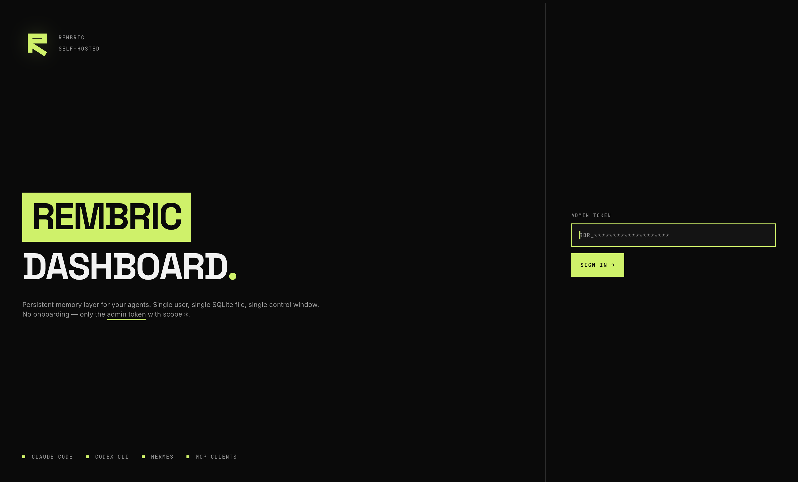
</p>

<p align="center"><i>Sign-in · one admin token, scope ✱.</i></p>

<p align="center">
  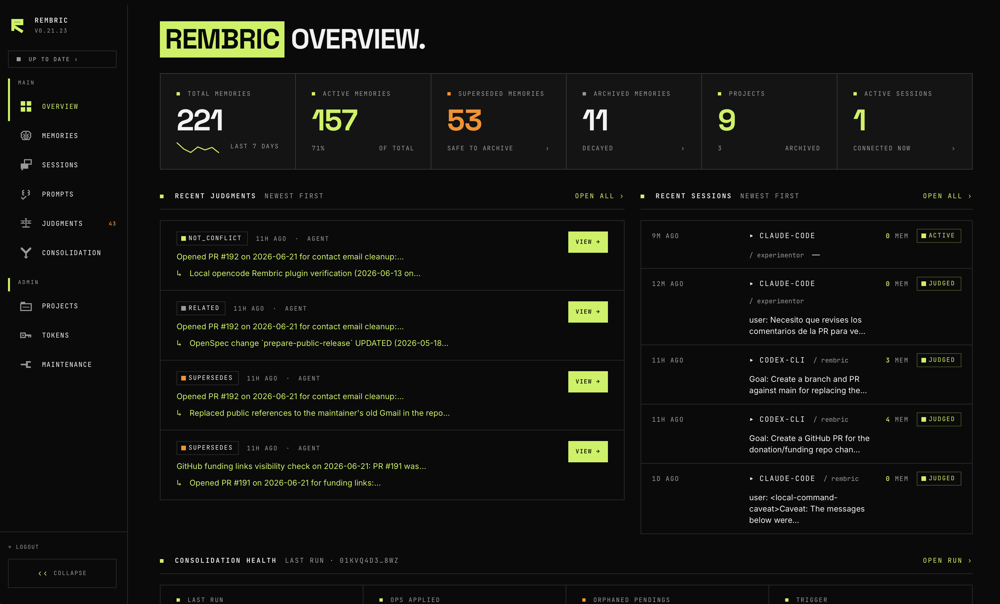
</p>

<p align="center"><i>Overview · counters, pending judgments queue, recent agent sessions.</i></p>

<details>
<summary><b>More surfaces</b> — consolidation health · memories · sessions · judgments · consolidation · projects · tokens · updates · maintenance</summary>

<br>

<p align="center">
  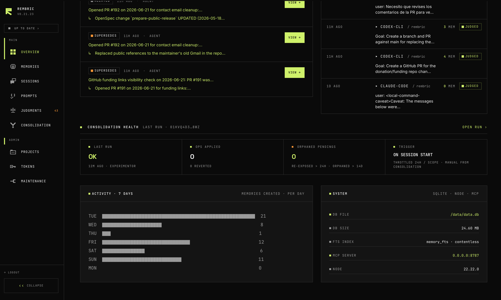
</p>

<p align="center"><i>Consolidation health · last run, ops applied, orphan pendings, 7-day activity, system info.</i></p>

<p align="center">
  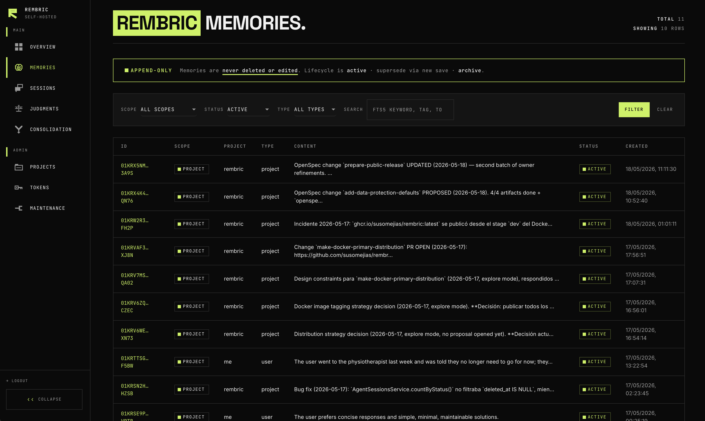
</p>

<p align="center"><i>Memories · append-only; filter by scope, status, type, FTS5 search.</i></p>

<p align="center">
  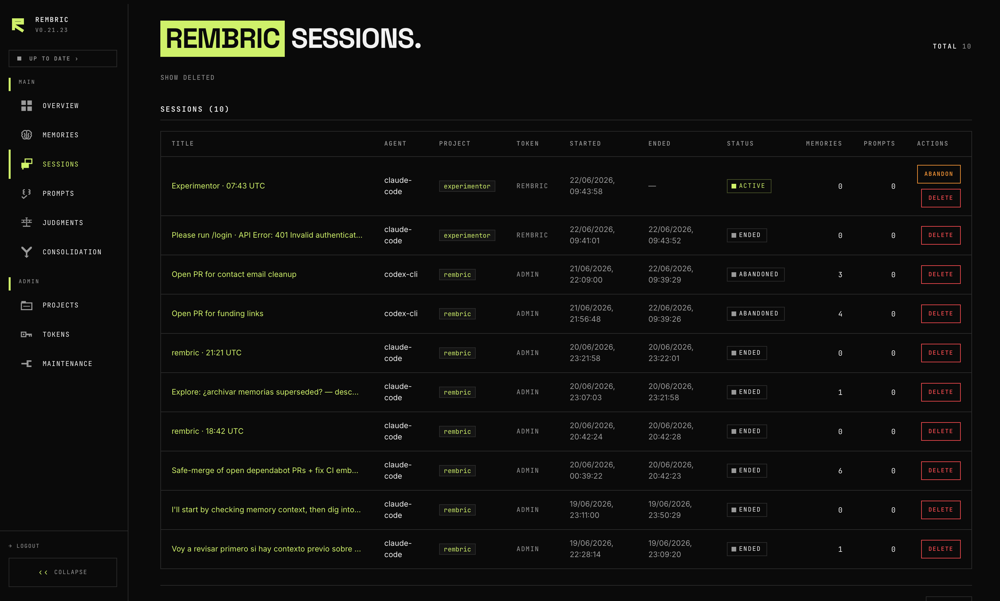
</p>

<p align="center"><i>Sessions · active, ended, and abandoned agent runs with memory and prompt counts.</i></p>

<p align="center">
  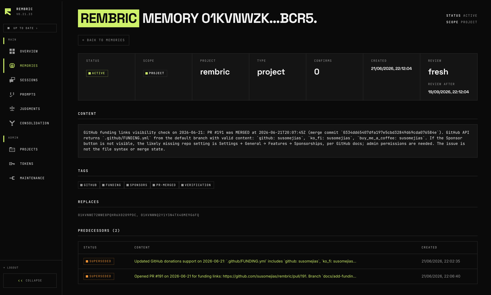
</p>

<p align="center"><i>Memory detail · status, scope, project, type, full content body.</i></p>

<p align="center">
  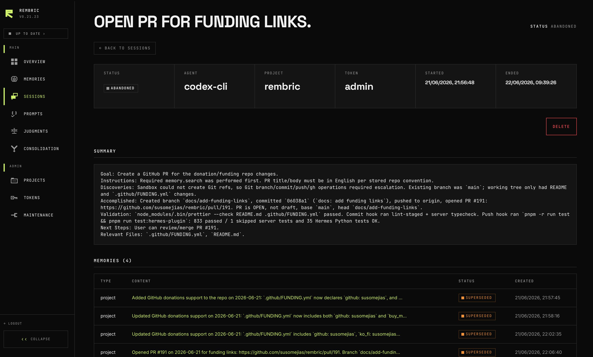
</p>

<p align="center"><i>Session detail · run metadata, summary, and memories attached to the session.</i></p>

<p align="center">
  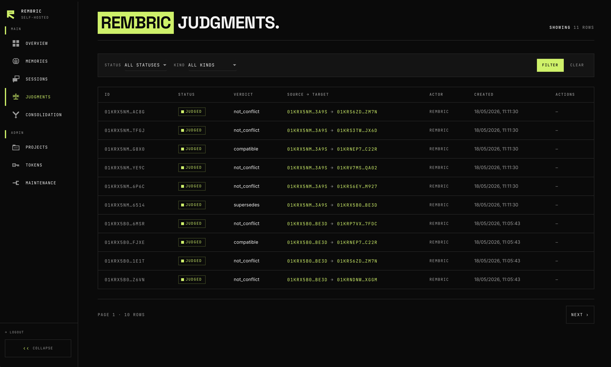
</p>

<p align="center"><i>Judgments · audit trail of every relation verdict — compatible, supersedes, not_conflict.</i></p>

<p align="center">
  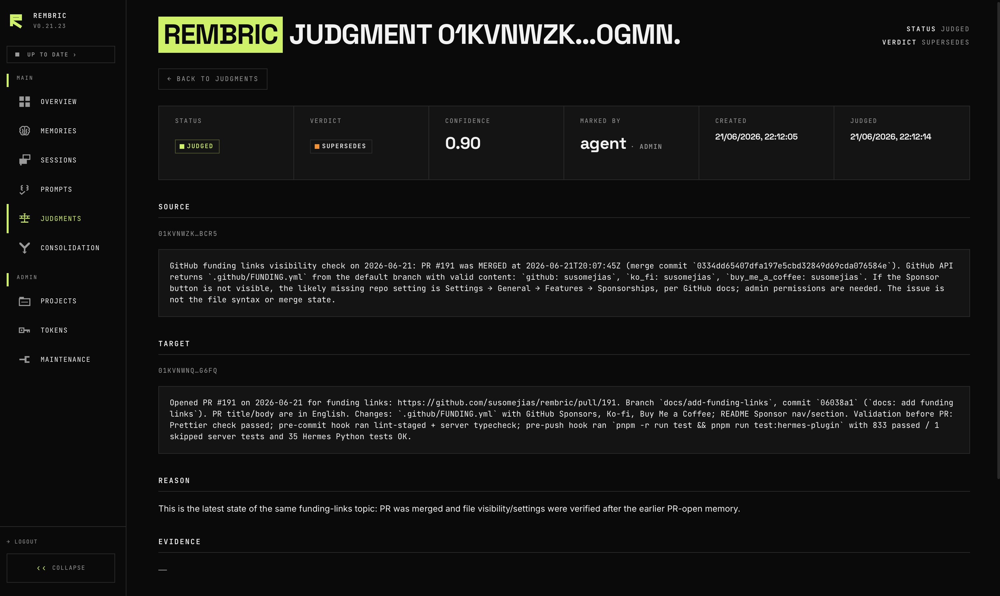
</p>

<p align="center"><i>Judgment detail · source, target, verdict, confidence, reason, and evidence for one relation.</i></p>

<p align="center">
  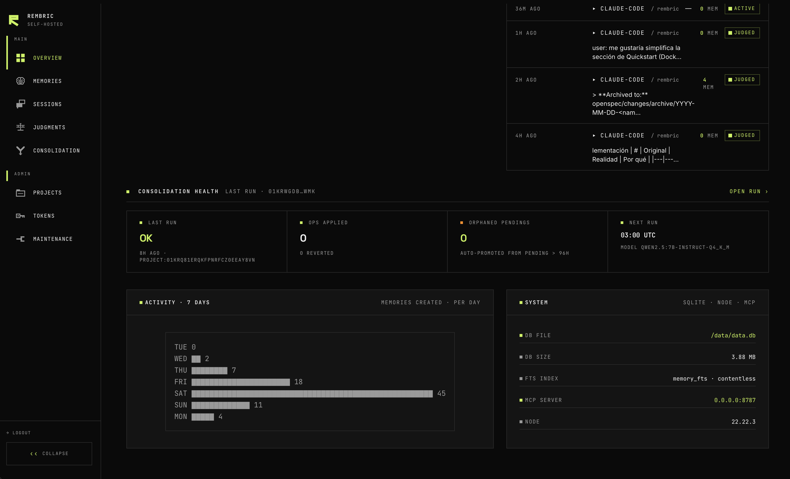
</p>

<p align="center"><i>Consolidation · manually trigger sweeps and inspect recent run status.</i></p>

<p align="center">
  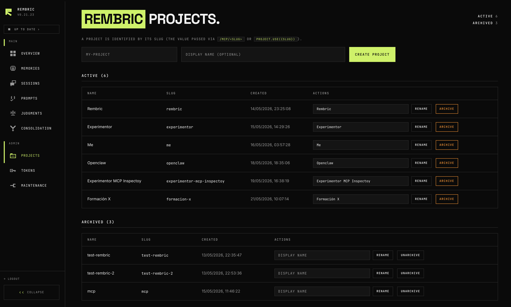
</p>

<p align="center"><i>Projects · slug-keyed, archivable. Each project is an isolated scope.</i></p>

<p align="center">
  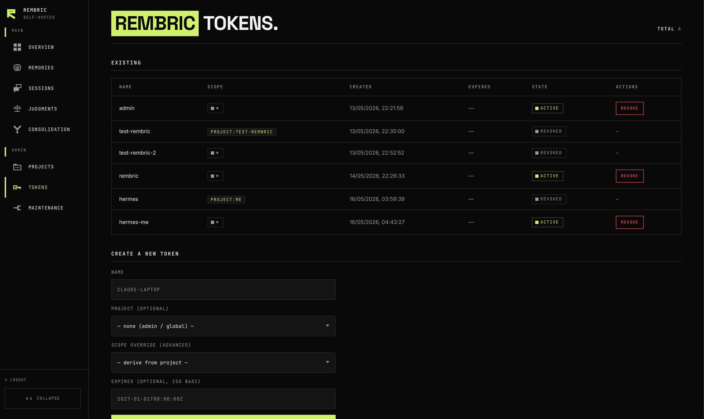
</p>

<p align="center"><i>Tokens · scope-bound (<code>*</code> or <code>project:&lt;slug&gt;</code>), revocable, expirable.</i></p>

<p align="center">
  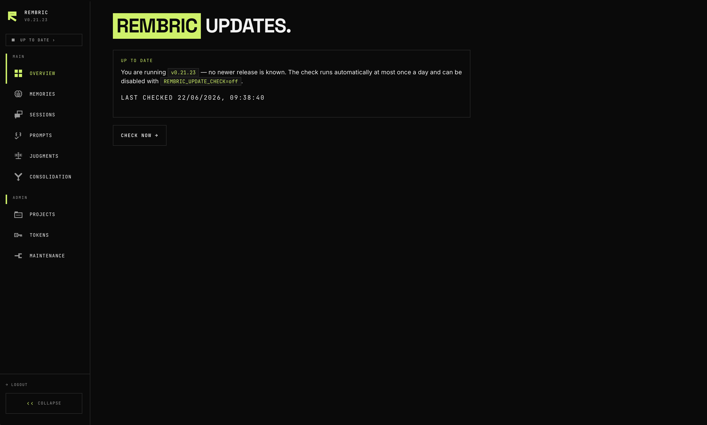
</p>

<p align="center"><i>Updates · current version, last check time, and manual release check.</i></p>

<p align="center">
  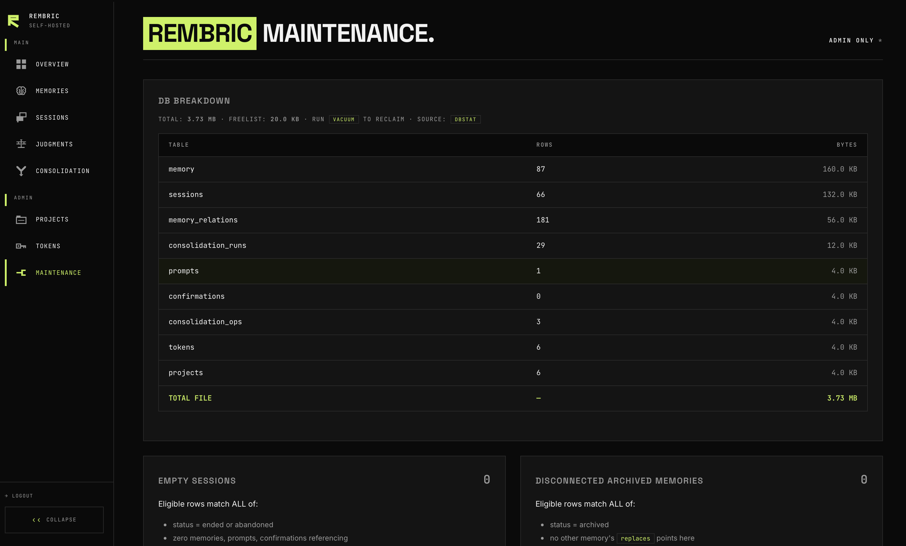
</p>

<p align="center"><i>Maintenance · DB breakdown + admin-only physical purges for empty sessions and disconnected archived memories.</i></p>

</details>

<details>
<summary><b>Operating Rembric</b> — tokens, projects, sessions, prompts, and the irreversible maintenance purges</summary>

<br>

Day-to-day operator work lives in the dashboard at [http://127.0.0.1:8787/dashboard](http://127.0.0.1:8787/dashboard) (port `8788` in the dev stack). Mint and revoke API tokens at `/dashboard/tokens`, create and archive projects at `/dashboard/projects`, soft-delete agent sessions at `/dashboard/sessions`, browse and soft-delete curated user prompts at `/dashboard/prompts` (FTS5 search over content + tags; refined predecessors show a `REFINED` badge), trigger consolidation at `/dashboard/consolidation`, and run the operator-only purges from `/dashboard/maintenance`. Programmatic agents talk to the same data through the MCP `project.*` / `memory.*` tools or, for admin-only operations, through the HTTP endpoints under `/admin/*` (admin bearer token required — see [docs/agents.md](./docs/agents.md)).

### Maintenance (manual purges)

The dashboard exposes `/dashboard/maintenance` for three **irreversible**, **operator-triggered** physical purges. All are gated to dashboard sessions whose underlying token has scope `*` (admin):

- **Purge empty sessions** — removes `ended` / `abandoned` session rows that have no summary, no manual title, no referencing memories / non-deleted prompts / confirmations, are not operator-soft-deleted, and ended over 1 hour ago. Soft-deleted prompts no longer block purge.
- **Purge disconnected archived memories** — removes `archived` memory rows whose ids are referenced by NO other row in the graph (`memory.replaces`, `consolidation_ops.affected_ids` / `created_id`, `memory_relations.{source,target}_id`, `confirmations.memory_id`). The matching `memory_vec` and `memory_fts` shadow rows are dropped in the same transaction.
- **Purge deleted prompts** — removes `prompts` rows whose `deleted_at IS NOT NULL`. Covers both operator soft-deletes (from `/dashboard/prompts`) and refine supersedes (from `memory.save_prompt({ replaces })`). The matching `prompts_fts` shadow row is dropped in the same transaction.

Each click shows a count and a confirmation modal. The deletion is journaled in `consolidation_ops` (`op_type = 'session_purge'`, `'archived_memory_purge'`, or `'prompt_purge'`) so the operator can audit what was removed even after the rows are gone. **Consolidation undo on operations whose rows have been purged returns a structured error** — the dashboard surfaces it inline naming the missing ids.

To reclaim file-level disk after a large purge, run `VACUUM` against the SQLite file. The maintenance page surfaces the freelist size so you know how much would be reclaimed.

</details>

## Architecture

Single Node process, single SQLite file, packaged as a multi-arch Docker image (`linux/amd64`, `linux/arm64`). Agents reach it over HTTP(S) + a bearer token at `/mcp/<slug>` (or `/mcp` + `project.use`); the operator dashboard is served from the same process.

Four load-bearing invariants:

- **Append-only**: rows are never deleted; `content` never updated. Lifecycle is `status` flips + `replaces` links. Every consolidation op is reversible. An agent MAY retire a memory at the user's explicit request via `memory.archive` (a reversible, journaled `active → archived` flip, scoped to the connection — no successor link, distinct from a `topic_key`/`memory.judge` supersede); physical purge stays operator-only in `/dashboard/maintenance`.
- **Project scoping by construction**: every memory is `global` or attached to one `project_id`. Consolidation and relations never cross scope.
- **Convergent topics via `topic_key`**: on `memory.save`, the previously-active row in the same `(scope, project_id, topic_key)` is auto-superseded atomically.
- **Fresh-context judgment**: candidate conflicts surface at save time (`candidates[]`); the agent that produced the conflict judges it. Aged pendings re-surface in `memory.context` until an agent closes them. The deterministic sweep (no LLM, no cron — runs on session start) only handles decay + deadline orphaning.

Memory also exposes a **derived review state** alongside decay: a `needs_review` flag on `memory.search` / `memory.get` rows (and a `needsReview[]` list in `memory.context`) for active memories whose per-type shelf life elapsed without re-affirmation. It is computed at read time — no column, no sweep — and is cleared by re-affirming with `memory.confirm` (not by merely reading). See [docs/relations.md](./docs/relations.md) for the relation taxonomy and the review axis.

### Entity index (exact-address retrieval)

Hybrid ranking is the right tool for "what did we decide about auth" and the wrong one for "what do I know about `apps/server/src/db/migrate.ts`". Identifiers are where ranked retrieval performs worst: quoted as an FTS5 phrase, a path also matches every longer path containing it (`migrate.ts` → `migrate.ts.bak`, `test/…/migrate.ts`), and separators the tokenizer drops take the identifier's precision with them (`#36` degrades to any bare "36"; `nas.local` matches the prose "the nas local drive"). Measured against an adversarial corpus, that is a 50–75% false-positive rate on those classes.

So Rembric keeps a small derived index of **syntactically unambiguous identifiers** — extracted by a pure regex function, no LLM, no network, ~5µs per memory, 0.05% of memory-related storage:

| kind           | examples                                                                 |
| -------------- | ------------------------------------------------------------------------ |
| `path`         | `apps/server/src/db/migrate.ts`, `.rembric`                              |
| `ticket`       | `#282`, `PROJ-1234`                                                      |
| `cve_id`       | `CVE-2024-3094`                                                          |
| `ip_address`   | `192.168.1.50`, `172.18.0.0/16`                                          |
| `hostname`     | `nas.local`, `plex.home` (`.local`/`.lan`/`.home`/`.internal`)           |
| `git_ref`      | `cfb5c04`, full 40-char SHAs                                             |
| `url`          | `https://…`                                                              |
| `error_code`   | `ENOENT`, `SQLITE_CANTOPEN`, `ERR_MODULE_NOT_FOUND`, `PERMISSION_DENIED` |
| `env_var`      | `$DATABASE_URL`, `${REMBRIC_TOKEN}`, `NODE_ENV=…`                        |
| `uuid`         | `550e8400-e29b-41d4-a716-446655440000`                                   |
| `systemd_unit` | `caddy.service`, `rembric-backup.timer`, `docker.socket`                 |
| `mac_address`  | `de:ad:be:ef:00:01`                                                      |

Extraction is precision-first by design: only closed, bounded syntax is admitted (a whitelist of errno and gRPC names rather than "any capitalised word", range-validated IP octets, fixed suffix lists, a `$`/`=` anchor for env vars). Where two classes share a shape they are separated by an anchor or a closed list, never by pattern order — a bare `SCREAMING_SNAKE` token is deliberately left untyped, since it is indistinguishable between an error code, an env var and a constant. A pattern is also narrowed below the class it names when the difference is prose: `systemd_unit` omits `.target`/`.path`/`.slice`/`.mount` because those are everyday property accessors (`event.target`, `array.slice`). Symbol identifiers, package names, semver, Docker image refs and cron expressions are **not** extracted at all — their shape cannot be bounded without matching prose, and a false link is worse than a missing one because it degrades exact lookup into bad text search.

The patterns live in one registry (`extractor-rules.ts`) where every rule must declare both the text it catches and the prose it must reject; a single suite runs the whole registry against those declarations, so a new kind is covered the moment it is added.

**A misclassification is never permanent.** Both entity tables are derived, so fixing a pattern is: correct it, bump the extractor version, deploy. The mismatch invalidates the index at boot and the drain recomputes it from the append-only `memory` rows — the bad link disappears, no memory is touched, and nothing needs migrating. An ordinary deployment does _not_ trigger this; only a recipe change does. Operators can also rebuild on demand from `/dashboard/entities` without waiting for a release.

The index backs three things, two of which need no agent opt-in:

- **`memory.search({ entity })`** — every linked memory in scope, chronological, complete: no ranking, no cutoff. Combined with `query` it narrows rather than fuses.
- **`memory.context`** — identifiers found in the session's focus text seed exact matches ahead of the ranked fallback (tagged `via: 'entity'`).
- **Save-time conflict detection** — a new memory sharing a sufficiently _rare_ entity with an active one becomes a `candidates[]` entry, catching contradictions that share no vocabulary and sit far apart in embedding space. Common entities are gated out (the same idea as IDF, applied to link counts).

It deliberately does **not** contribute a stream to the hybrid RRF fusion: in its own author's published benchmark, adding a graph stream to BM25+vector _reduced_ Recall@5 versus BM25 alone. Operators can browse and rebuild the index at `/dashboard/entities`.

<details>
<summary><b>Process diagram</b> — transports, service layer, storage, in-process background work</summary>

<br>

```
        ┌──────────────────────────────────────────────────────────────┐
        │  4 PLUGIN clients — tools AND session lifecycle              │
        │    Claude Code · Codex CLI · Hermes Agent · opencode          │
        │  Any other MCP client — tools only, no lifecycle             │
        │    Cursor · Windsurf · Claude Desktop · Cline · Goose · …     │
        └───────────┬──────────────────────────────────┬───────────────┘
                    │                                  │
     MCP: HTTP(S) + Bearer                Session lifecycle: HTTP(S)
     /mcp/<slug>  or  /mcp + project.use  POST /api/<slug>/sessions{,/:id/end,/:id/summary}
                    │                     (hooks + in-process providers; never MCP)
                    ▼                                  ▼
   ┌───────────────────────────────────────────────────────────────────────┐
   │                       rembric  (single Node process)                  │
   │                                                                       │
   │  ┌──────────────────────────┐ ┌──────────────┐ ┌──────────────────┐   │
   │  │  /mcp     /mcp/<slug>    │ │ /api/<slug>  │ │ /dashboard       │   │
   │  │  Streamable HTTP         │ │ session      │ │ SSR HTML + HTMX  │   │
   │  │  + initialize.instructions│ │ lifecycle   │ │                  │   │
   │  │                          │ └──────┬───────┘ │ /memories        │   │
   │  │  memory.{save,search,get,│        │         │ /sessions        │   │
   │  │    context,timeline,     │        │         │ /prompts         │   │
   │  │    confirm,archive,      │        │         │ /judgments       │   │
   │  │    judge,compare,        │        │         │ /entities        │   │
   │  │    stats,doctor,about,   │        │         │ /consolidation   │   │
   │  │    suggest_topic_key,    │        │         │ /projects        │   │
   │  │    capture_passive}      │        │         │ /tokens          │   │
   │  │  memory.session_*        │        │         │ /maintenance     │   │
   │  │  memory.*_prompt(s)      │        │         │ /oauth  /update  │   │
   │  │  project.{use,list,      │        │         │                  │   │
   │  │    current}              │        │         │                  │   │
   │  └────────────┬─────────────┘        │         └────────┬─────────┘   │
   │               ▼                      ▼                  ▼             │
   │  ┌─────────────────────────────────────────────────────────────────┐  │
   │  │  Service layer  (owns scope resolution + transactions)          │  │
   │  │   MemoryService · PromptsService · RelationsService             │  │
   │  │   ProjectsService · TokensService · AgentSessionsService         │  │
   │  │   EntitiesService · OAuthService · SessionRouter                │  │
   │  │   hybrid-search · review (derived) · save-time-candidates       │  │
   │  └──────────────────────────────┬──────────────────────────────────┘  │
   │                                 ▼                                     │
   │  ┌─────────────────────────────────────────────────────────────────┐  │
   │  │  Repositories — the ONLY place SQL lives (src/db/)              │  │
   │  └──────────────────────────────┬──────────────────────────────────┘  │
   │                                 ▼                                     │
   │  ┌─────────────────────────────────────────────────────────────────┐  │
   │  │  SQLite (Drizzle, append-only + tombstones)                     │  │
   │  │   memory · projects · tokens · sessions · prompts                │  │
   │  │   confirmations · memory_relations · entities · memory_entities  │  │
   │  │   consolidation_{runs,ops} · dashboard_sessions · oauth_*        │  │
   │  │   + memory_fts · prompts_fts (FTS5)  + memory_vec (sqlite-vec)   │  │
   │  └──────────────────────────────▲──────────────────────────────────┘  │
   │  ┌──────────────────────────────┴──────────────────────────────────┐  │
   │  │  In-process background work (no external services)              │  │
   │  │   embedder: gte-multilingual-base, ONNX q8, loaded at boot       │  │
   │  │   embedding drain worker      → fills memory_vec                 │  │
   │  │   entity backfill worker      → fills entities/memory_entities   │  │
   │  │   deterministic sweep: decay + deadline orphaning (no LLM/cron)  │  │
   │  └─────────────────────────────────────────────────────────────────┘  │
   └───────────────────────────────────────────────────────────────────────┘
```

Two staleness axes, deliberately distinct: **decay** runs in the background sweep above (access + confidence, keyed on `last_seen_at` → archives); **review** is derived in the request path on `memory.search` / `memory.get` / `memory.context` (affirmation, keyed on `max(created_at, last confirmation) + per-type TTL` → flags `needs_review`). Review adds no table, no tool, and no background work — it is computed at read time and cleared by `memory.confirm`.

</details>

## Development

```bash
pnpm install
pnpm run dev          # tsc --watch
pnpm test             # full vitest suite + Hermes Python tests
pnpm run typecheck    # tsc --noEmit
pnpm run lint
```

For a clean Docker build from source:

```bash
docker compose -f docker-compose.yml -f docker-compose.build.yml up -d --build
```

### CodeGraph (code intelligence)

This repo ships a committed [CodeGraph](https://github.com/codegraph) setup so agents can query the codebase as a knowledge graph. The MCP server is registered in `.mcp.json` (Claude Code) and `opencode.jsonc` (opencode); both point at a local `codegraph` binary.

CodeGraph is **opt-in per developer** — install the binary to enable it:

```bash
# install the codegraph CLI, then from the repo root:
codegraph index        # builds .codegraph/codegraph.db (git-ignored, ~11 MB)
```

If you do **not** install the binary, nothing breaks: the `codegraph` MCP entry just shows as failed/unavailable in `/mcp` and every other workflow is unaffected. The index, daemon socket, pid, and logs under `.codegraph/` are git-ignored (only `.codegraph/.gitignore` is committed) — they are local to each machine and never belong in a commit.

## More docs

- [docs/docker.md](./docs/docker.md) — Docker operator guide (topologies, GHCR auth, upgrade/rollback, troubleshooting).
- [docs/agents.md](./docs/agents.md) — per-client MCP config (Codex, Cursor, Windsurf, VS Code, Gemini, …).
- [docs/backup.md](./docs/backup.md) — backup strategies and restore recipes for the SQLite data file.
- [docs/updates.md](./docs/updates.md) — update notifications and the opt-in one-click auto-updater from the dashboard.
- [docs/troubleshooting.md](./docs/troubleshooting.md) — common errors and recovery.

## Project status

Rembric is open-source under the MIT License — **as-is, no warranty**. The maintainers do not accept responsibility for operator data loss, deployment downtime, or any other operational consequence of running the software.

- **Security**: vulnerability reports go through [SECURITY.md](./SECURITY.md). Preferred channel is GitHub Security Advisories.
- **Backups**: the entire server state lives in one SQLite file. Operators are responsible for backing it up; see [docs/backup.md](./docs/backup.md) for `sqlite3 .backup` cron, manual snapshots, and litestream.
- **Versioning**: SemVer, driven by release-please. Pre-1.0 means the wire and HTTP contracts may shift across minors; check release notes before upgrading.

## Contributing

See [CONTRIBUTING.md](./CONTRIBUTING.md). Commits follow Conventional Commits; pre-commit lints and typechecks; pre-push runs the full test suite.

## Sponsor

If Rembric saves you time, you can support its maintenance through [GitHub Sponsors](https://github.com/sponsors/susomejias), [Ko-fi](https://ko-fi.com/susomejias), or [Buy Me a Coffee](https://buymeacoffee.com/susomejias).

## License

MIT — see [LICENSE](./LICENSE).
